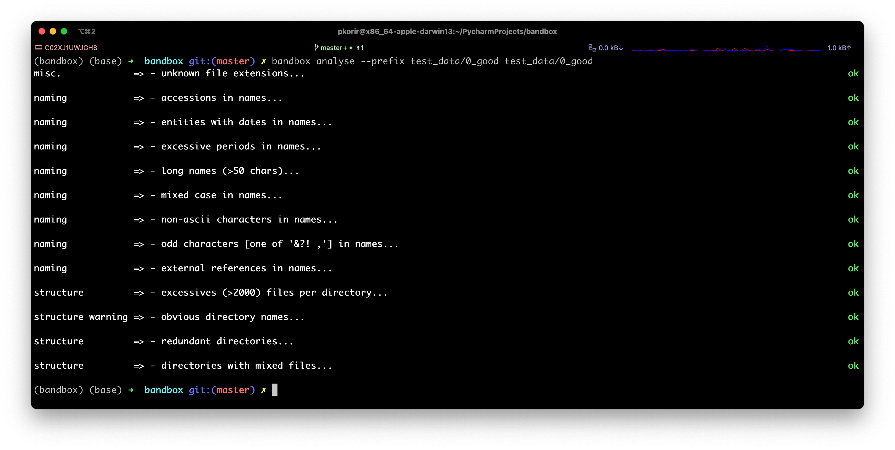
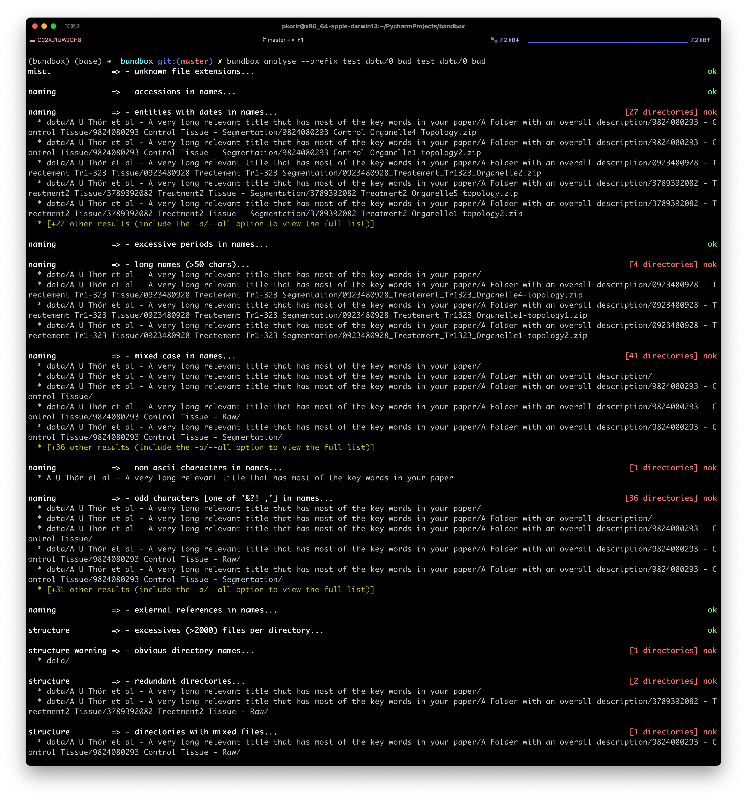

# `bandbox`

`bandbox` is a CLI tool to quickly evaluate how organised your dataset is. You can use `bandbox` on any directory and it will recursively descend through to all subdirectories to assess whether the structure and names are easy to use. `bandbox` reads in a set of configs a config file (`bandbox.cfg`), which it uses to assess your dataset. Once complete, `bandbox` displays various assessments and whether they are <span style='color: green'>`ok`</span> or <span style='color:red'>`nok`</span>, together with details about which paths from the specified directory have failed that assessment. The user may also display the directory tree using the `--show-tree` option as well as show all results using the `-a/--all`; by default, a summary of analysis results is displayed, which modified using the `--summarise-size` option. 

> :bulb: **Tip**: Bear in mind that `bandbox` only makes suggestions on how to make your dataset more usable; you are in the best position to decide whether `nok` is a real problem. It might help you discover unwanted files e.g. `log` files, temporary files such as `*.tif~`, operating system fluff like `.DS_Store` files on macOS etc.

## Installing `bandbox`

Install from source into a virtualenv using:

```shell
~$ pip install git+https://github.com/emdb-empiar/bandbox
```

or from PyPI using:

```shell
~$ pip install bandbox
```

## Configuring `bandbox`

When you first try to run `bandbox` you will get an error message like this:

```shell
~$ bandbox
error: no configs found; please set BANDBOX_CONFIG envvar or provide --config-file path
info: copy and modify the config file from https://raw.githubusercontent.com/emdb-empiar/bandbox/master/bandbox.cfg
```

Download the config file from the link provided in the error message and save it as `bandbox.cfg` in your current directory.

```shell
# if you use wget
~$ wget https://raw.githubusercontent.com/emdb-empiar/bandbox/master/bandbox.cfg
# if you use curl
~$ curl https://raw.githubusercontent.com/emdb-empiar/bandbox/master/bandbox.cfg > bandbox.cfg
# you can either reference the config file using the --config-file option
~$ bandbox --config-file bandbox.cfg
# or set the BANDBOX_CONFIG environment variable; make sure to use the full path
~$ export BANDBOX_CONFIG=`realpath bandbox.cfg`
# add the `export BANDBOX_CONFIG=`realpath bandbox.cfg`` line to your ~/.bashrc or ~/.zshrc file
```

## Example usage

This is what an 'ok' dataset would look like:



and this is what a 'nok' one would look like:




## Viewing the tree

Use the `view` command to view the tree implied by the dataset. 

```shell
~$ bandbox view # to view the current directory
~$ bandbox view some_path
~$ bandbox view some_path --prefix some_path # will exclude 'some_path' from every path entry
~$ bandbox view some_path --hide-file-counts # only show file totals
```

> :warning: **Warning**: Some options are experimental and incomplete e.g. `--input-file`, which takes the output of Python's `glob.glob(path, recursive=True)` function saved as a string.

Here is an example based on the `test_data` directory in the git repository:

```shell
~$ bandbox view test_data
└── test_data
 	└── 0_bad
 		└── data
 			└── A U Thör et al - A very long relevant title that has most of the key words in your paper
 				└── A Folder with an overall description
 					└── 9824080293 - Control Tissue
 						└── 9824080293 Control Tissue - Raw
 							└── [2000 files: tif=1000; jpg=1000; ]
						└── 9824080293 Control Tissue - Segmentation
 							└── [7 files: zip=7; ]
					└── 3789392082 - Treatment2 Tissue
 						└── 3789392082 Treatment2 Tissue - Raw
 							└── 3789392082 raw
 								└── [1000 files: tif=1000; ]
						└── 3789392082 Treatment2 Tissue - Segmentation
 							└── [7 files: zip=7; ]
					└── 9028340982 - Treatment1 Tissue
 						└── 9028340982 Treatment1 Tissue - Raw
 							└── [1000 files: tif=1000; ]
						└── 9028340982 Treatment1 Tissue - Segmentation
 							└── [7 files: zip=7; ]
					└── 0923480928 - Treatement Tr1-323 Tissue
 						└── 0923480928 Treatement Tr1-323 Segmentation
 							└── [6 files: zip=6; ]
						└── 0923480928 Treatement Tr1-323 Raw
 							└── [1000 files: tif=1000; ]
	└── folder_with_multiple_folders
 		└── folder5
 			└── [10 files: tif=10; ]
		└── folder2
 			└── [10 files: tif=10; ]
		└── folder3
 			└── [10 files: tif=10; ]
		└── folder4
 			└── [10 files: tif=10; ]
		└── folder1
 			└── [10 files: tif=10; ]
		└── folder6
 			└── [100 files: dog=100; ]
		└── folder7
 			└── [2001 files: jpeg=2001; ]
	└── 0_good
 		└── [1 file: md=1; ]
		└── brief_description
 			└── control_tissue
 				└── segmentation
 					└── [7 files: zip=7; ]
				└── raw
 					└── [1000 files: tif=1000; ]
			└── treatment3_tissue
 				└── segmentation
 					└── [6 files: zip=6; ]
				└── raw
 					└── [1000 files: tif=1000; ]
			└── treatment1_tissue
 				└── segmentation
 					└── [7 files: zip=7; ]
				└── raw
 					└── [1000 files: tif=1000; ]
			└── treatment2_tissue
 				└── segmentation
 					└── [7 files: zip=7; ]
				└── raw
 					└── [1000 files: tif=1000; ]
	└── folder_with_single_file
 		└── folder
 			└── [1 file: txt=1; ]
	└── folder_with_date_name_files
 		└── [12 files: txt=10; raw=2; ]
	└── folder_with_multiple_files
 		└── folder
 			└── [12 files: txt=10; tif=1; md=1; ]
	└── folder_with_multiple_file_types
 		└── folder
 			└── [20 files: txt=10; tif=10; ]
			└── files
 			└── inner_folder
 	└── empty_folder
 		└── folder
 	└── single_empty_folder
 		└── folder
 			└── inner_folder
 	└── folder_with_long_name_folders
 		└── a folder with spaces in the name
 		└── [1 file: mrc=1; ]
		└── folder
 			└── [26 files: dog=1; txt=11; tif=10; jpg=2; onx=1; wrx=1; ]
			└── files
 			└── inner_folder
 				└── another_very_long_name_that_we_are_still_wondering_ever_found_the_light_of_day
 		└── a folder with & funny symbols in the ?? name
 		└── a_folder_with_a_very_long_name_that_we_cannot_even_begin_to_comprehend
 		└── a.folder.with.periods.in.the.name
 	└── folder_with_non_ascii_characters
 		└── wïth_ñõn_æšçiį
 		└── dataset
 		└── datasets
 		└── with_ascii
```

## Analysing the tree

Use the `analyse` command to run the assessments on your dataset. Here is an example output using `--show-tree` option:

```shell
~$ bandbox analyse test_data --show-tree
# displays the tree then the summarised results
```

## Modifying configs
`bandbox` uses simple heuristics to analyse a dataset most of which run regular expressions against elements of the tree. A lot of these are raw regex components that are outlined in the config file, which may either be specified using the `BANDBOX_CONFIG` or `--config-file` option.

Once you have a better idea of how `bandbox` works, feel free to modify the config file to suit your needs. The config file is divided into two sections: `[bandbox]` and `[regex]`. The `[bandbox]` section contains the configs which are used to assess your dataset. The `[regex]` section contains the regular expressions which are used to assess your dataset.

Here is a summary (annotated) of the current configs:

```ini
[bandbox]
file_extensions = jpg|jpeg|mrc|mrcs|tif|tiff|dm4|txt|box|cfg|fixed|st|rec|map|bak|eer|bz2|gz|zip|xml|am|star|raw|dat
obvious_files = file|files|data|folder|inner_folder|images|directory
# per directory
max_files = 2000
max_name_length = 50
# date_infix_chars must start with '-'
date_infix_chars = -:/.
month_chars = jan|feb|mar|apr|may|jun|jul|aug|sep|oct|nov|dec|january|february|march|april|may|june|july|august|september|october|november|december
accession_names = EMPIAR|EMDB
odd_chars = &?! ,
periods_in_name_fewer_than = 2
external_refs = figure|supplementary

[regex]
file_re = (?i)^([^.]*\.[^.]*|.*\.(${bandbox:file_extensions}))$$
file_extension_re = (?i)^.*\.(${bandbox:file_extensions})$$
obvious_files_re = (?i)^(${bandbox:obvious_files})$$
accession_names_re = (?i)^.*(${bandbox:accession_names}).*$$
odd_chars_re = .*[${bandbox:odd_chars}].*
periods_in_name_fewer_than_re = .*([.].*){${bandbox:periods_in_name_fewer_than},}.*
external_refs_re = (?i)^.*(${bandbox:external_refs}).*$$
# 12/31/2000 or 31/12/2000
# 2000[]12[]31 or 2000[]31[]12
# 31[]12[]00
# 31[]Dec[]2000
# Dec[]31[]2000
date_re = (?i)^.*\d{2}[${bandbox:date_infix_chars}]*\d{2}[${bandbox:date_infix_chars}]*\d{4}.*$$,(?i)^.*\d{4}[${bandbox:date_infix_chars}]*\d{2}[${bandbox:date_infix_chars}]*\d{2}.*$$,(?i)^.*\d{2}[${bandbox:date_infix_chars}]*\d{2}[${bandbox:date_infix_chars}]*\d{2}.*$$,(?i)^.*\d{2}[${bandbox:date_infix_chars}]*(${bandbox:month_chars})[${bandbox:date_infix_chars}]*\d{4}.*$$,(?i)^.*\d{4}[${bandbox:date_infix_chars}]*(${bandbox:month_chars})[${bandbox:date_infix_chars}]*\d{2}.*$$
```


## Interested in contributing?
Do you have ideas on other heuristics that can be used to improve the organisation of your data? For example, wouldn't it be cool to infer folder names which are closely related but which have different spellings or typos e.g. `tomos`, `tomograms` and `Tomograms` in the same dataset probably refer to the same kind of data and could simply all be called `tomograms`. 

Please get in touch then we can provide a step-by-step guide to do so. 
