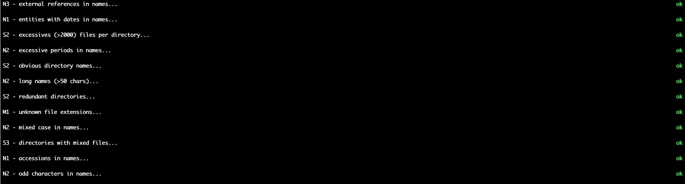

# `bandbox`

`bandbox` is a CLI tool to quickly evaluate how organised your dataset is. You can use `bandbox` on any directory and it will recursively descend through to all subdirectories to assess whether the structure and names are easy to use. `bandbox` reads in a set of configs a config file (`bandbox.cfg`), which it uses to assess your dataset. Once complete, `bandbox` displays various assessments and whether they are <span style='color: green'>`ok`</span> or <span style='color:red'>`nok`</span>, together with details about which paths from the specified directory have failed that assessment. The user may also display the directory tree using the `--show-tree` option as well as summarise the output using the `--summarise` option which may be modified using the `--summarise-size` option. 

## Installing `bandbox`

Install from source into a virtualenv using:

```shell
~$ pip install git+https://github.com/emdb-empiar/bandbox
```

or from PyPI using:

```shell
~$ pip install bandbox
```
Here is example output run on EMPIAR-10002 data (using the path `10002/data` and `--prefix 10002/data`):



> :bulb: **Tip**: Bear in mind that `bandbox` only makes suggestions on how to make your dataset more usable; you are in the best position to decide whether a `fail` is a real fail. It might help you discover unwanted files e.g. `log` files, temporary files such as `*.tif~`, operating system fluff like `.DS_Store` files on macOS etc.

## Viewing the tree

Use the `view` command to view the tree implied by the dataset. 

```shell
~$ bandbox view # to view the current directory
~$ bandbox view some_path
~$ bandbox view some_path --prefix some_path # will exclude 'some_path' from every path entry
~$ bandbox view some_path --hide-file-counts # only show file totals
```

> :warning: **Warning**: Some options are experimental and incomplete e.g. `--input-file`, which takes the output of Python's `glob.glob(path, recursive=True)` function saved as a string.

Here is an example based on the `test_data` directory in the git repository:

```shell
~$ bandbox view test_data
info: successfully retrieved up-to-date data...
└── test_data
        └── folder_with_multiple_folders
                └── folder5
                        └── [10 files: tif=10; ]
                └── folder2
                        └── [10 files: tif=10; ]
                └── folder3
                        └── [10 files: tif=10; ]
                └── folder4
                        └── [10 files: tif=10; ]
                └── folder1
                        └── [10 files: tif=10; ]
                └── folder6
                        └── [100 files: dog=100; ]
        └── folder_with_single_file
                └── folder
                        └── [1 file: txt=1; ]
        └── folder_with_date_name_files
                └── [12 files: txt=10; raw=2; ]
        └── folder_with_multiple_files
                └── folder
                        └── [11 files: txt=10; tif=1; ]
        └── folder_with_multiple_file_types
                └── folder
                        └── [20 files: txt=10; tif=10; ]
                        └── files
                        └── inner_folder
        └── empty_folder
                └── folder
        └── single_empty_folder
                └── folder
                        └── inner_folder
        └── folder_with_long_name_folders
                └── a folder with spaces in the name
                └── folder
                        └── [26 files: dog=1; txt=11; tif=10; jpg=2; onx=1; wrx=1; ]
                        └── files
                        └── inner_folder
                                └── another_very_long_name_that_we_are_still_wondering_ever_found_the_light_of_day
                └── a folder with & funny symbols in the ?? name
                └── a_folder_with_a_very_long_name_that_we_cannot_even_begin_to_comprehend
                └── a.folder.with.periods.in.the.name
```

## Analysing the tree

Use the `analyse` command to run the assessments on your dataset. Here is an example output using the `--summarise` and `--show-tree` options:

> In the results below, **N** indicates a _naming_ issue, **S** a _structural_ issue (the folder structure) and **M** are _miscellaneous_ issues (e.g. warnings about unknown file extensions). Scroll horizontally (Shift+Scroll) to see the number of issues in each category.

```shell
~$ bandbox analyse test_data --show-tree --summarise
info: successfully retrieved up-to-date data...
└── test_data
        └── folder_with_multiple_folders
                └── folder5
                        └── [10 files: tif=10; ]
                └── folder2
                        └── [10 files: tif=10; ]
                └── folder3
                        └── [10 files: tif=10; ]
                └── folder4
                        └── [10 files: tif=10; ]
                └── folder1
                        └── [10 files: tif=10; ]
                └── folder6
                        └── [100 files: dog=100; ]
        └── folder_with_single_file
                └── folder
                        └── [1 file: txt=1; ]
        └── folder_with_date_name_files
                └── [12 files: txt=10; raw=2; ]
        └── folder_with_multiple_files
                └── folder
                        └── [11 files: txt=10; tif=1; ]
        └── folder_with_multiple_file_types
                └── folder
                        └── [20 files: txt=10; tif=10; ]
                        └── files
                        └── inner_folder
        └── empty_folder
                └── folder
        └── single_empty_folder
                └── folder
                        └── inner_folder
        └── folder_with_long_name_folders
                └── a folder with spaces in the name
                └── folder
                        └── [26 files: dog=1; txt=11; tif=10; jpg=2; onx=1; wrx=1; ]
                        └── files
                        └── inner_folder
                                └── another_very_long_name_that_we_are_still_wondering_ever_found_the_light_of_day
                └── a folder with & funny symbols in the ?? name
                └── a_folder_with_a_very_long_name_that_we_cannot_even_begin_to_comprehend
                └── a.folder.with.periods.in.the.name
 
M1 - unknown file extensions...                                                                       [103 directories] nok
  * test_data/folder_with_multiple_folders/folder6/file2.dog
  * test_data/folder_with_multiple_folders/folder6/file30.dog
  * test_data/folder_with_multiple_folders/folder6/file24.dog
  * test_data/folder_with_multiple_folders/folder6/file18.dog
  * test_data/folder_with_multiple_folders/folder6/file19.dog
  * [+98 others (remove --summarise option to view the full list)]

N1 - accessions in names...                                                                             [1 directories] nok
  * test_data/folder_with_multiple_files/folder/file-EMPIAR-someting.tif

N1 - entities with dates in names...                                                                   [10 directories] nok
  * test_data/folder_with_date_name_files/prefix-2000-12-31-suffix.txt
  * test_data/folder_with_date_name_files/prefix-001231-suffix.txt
  * test_data/folder_with_date_name_files/prefix-20001231-suffix.txt
  * test_data/folder_with_date_name_files/prefix-12312000-suffix.txt
  * test_data/folder_with_date_name_files/prefix-31-December-2000-suffix.txt
  * [+5 others (remove --summarise option to view the full list)]

N2 - excessive periods in names...                                                                      [2 directories] nok
  * test_data/folder_with_long_name_folders/folder/a.file.with.many.periods.txt
  * test_data/folder_with_long_name_folders/a.folder.with.periods.in.the.name

N2 - long names (>20 chars)...                                                                         [11 directories] nok
  * test_data/folder_with_multiple_folders
  * test_data/folder_with_single_file
  * test_data/folder_with_date_name_files
  * test_data/folder_with_multiple_files
  * test_data/folder_with_multiple_file_types
  * [+6 others (remove --summarise option to view the full list)]

N2 - mixed case in names...                                                                             [5 directories] nok
  * test_data/folder_with_date_name_files/prefix-31-Dec-2000-suffix.txt
  * test_data/folder_with_date_name_files/prefix-Dec-31-2000-suffix.txt
  * test_data/folder_with_date_name_files/prefix-31:December:2000-suffix.txt
  * test_data/folder_with_date_name_files/prefix-31-December-2000-suffix.txt
  * test_data/folder_with_multiple_files/folder/file-EMPIAR-someting.tif

N2 - odd characters in names...                                                                         [2 directories] nok
  * test_data/folder_with_long_name_folders/a folder with spaces in the name
  * test_data/folder_with_long_name_folders/a folder with & funny symbols in the ?? name

N3 - external references in names...                                                                    [2 directories] nok
  * test_data/folder_with_long_name_folders/folder/supplementary-figure3a.jpg
  * test_data/folder_with_long_name_folders/folder/figure5.jpg

S2 - excessives (>5) files per directory...                                                            [10 directories] nok
  * test_data/folder_with_multiple_folders/folder5/
  * test_data/folder_with_multiple_folders/folder2/
  * test_data/folder_with_multiple_folders/folder3/
  * test_data/folder_with_multiple_folders/folder4/
  * test_data/folder_with_multiple_folders/folder1/
  * [+5 others (remove --summarise option to view the full list)]

S2 - obvious directory names...                                                                        [11 directories] nok
  * test_data/folder_with_single_file/folder
  * test_data/folder_with_multiple_files/folder
  * test_data/folder_with_multiple_file_types/folder
  * test_data/folder_with_multiple_file_types/folder/files
  * test_data/folder_with_multiple_file_types/folder/inner_folder
  * [+6 others (remove --summarise option to view the full list)]

S2 - redundant directories...                                                                          [16 directories] nok
  * test_data/folder_with_multiple_files
  * test_data/folder_with_multiple_file_types
  * test_data/folder_with_multiple_file_types/folder/files
  * test_data/folder_with_multiple_file_types/folder/inner_folder
  * test_data/empty_folder
  * [+11 others (remove --summarise option to view the full list)]

S3 - directories with mixed files...                                                                    [4 directories] nok
  * test_data/folder_with_date_name_files/
  * test_data/folder_with_multiple_files/folder/
  * test_data/folder_with_multiple_file_types/folder/
  * test_data/folder_with_long_name_folders/folder/

```

## Setting configs
`bandbox` uses simple heuristics to analyse a dataset. These should be provided in a config file which may either be specified using the `BANDBOX_CONFIG` or `--config-file` option. Download and modify the template available at `https://raw.githubusercontent.com/emdb-empiar/bandbox/master/bandbox.cfg`.

Here is a summary (annotated) of the current configs:

```ini
[bandbox]
file_extensions = jpg|jpeg|mrc|mrcs|tif|tiff|dm4|txt|box|cfg|fixed|st|rec|map|bak|eer|bz2|gz|zip|xml|am|star|raw|dat
obvious_files = file|files|data|folder|inner_folder|images|directory
# per directory
max_files = 2000
max_name_length = 50
# date_infix_chars must start with '-'
date_infix_chars = -:/.
month_chars = jan|feb|mar|apr|may|jun|jul|aug|sep|oct|nov|dec|january|february|march|april|may|june|july|august|september|october|november|december
accession_names = EMPIAR|EMDB
odd_chars = &?! ,
periods_in_name_fewer_than = 2
external_refs = figure|supplementary

[regex]
file_re = (?i)^([^.]*\.[^.]*|.*\.(${bandbox:file_extensions}))$$
file_extension_re = (?i)^.*\.(${bandbox:file_extensions})$$
obvious_files_re = (?i)^(${bandbox:obvious_files})$$
accession_names_re = (?i)^.*(${bandbox:accession_names}).*$$
odd_chars_re = .*[${bandbox:odd_chars}].*
periods_in_name_fewer_than_re = .*([.].*){${bandbox:periods_in_name_fewer_than},}.*
external_refs_re = (?i)^.*(${bandbox:external_refs}).*$$
# 12/31/2000 or 31/12/2000
# 2000[]12[]31 or 2000[]31[]12
# 31[]12[]00
# 31[]Dec[]2000
# Dec[]31[]2000
date_re = (?i)^.*\d{2}[${bandbox:date_infix_chars}]*\d{2}[${bandbox:date_infix_chars}]*\d{4}.*$$,(?i)^.*\d{4}[${bandbox:date_infix_chars}]*\d{2}[${bandbox:date_infix_chars}]*\d{2}.*$$,(?i)^.*\d{2}[${bandbox:date_infix_chars}]*\d{2}[${bandbox:date_infix_chars}]*\d{2}.*$$,(?i)^.*\d{2}[${bandbox:date_infix_chars}]*(${bandbox:month_chars})[${bandbox:date_infix_chars}]*\d{4}.*$$,(?i)^.*\d{4}[${bandbox:date_infix_chars}]*(${bandbox:month_chars})[${bandbox:date_infix_chars}]*\d{2}.*$$
```

## Interested in contributing?
Do you have ideas on other heuristics that can be used to improve the organisation of your data? For example, wouldn't it be cool to infer folder names which are closely related but which have different spellings or typos e.g. `tomos`, `tomograms` and `Tomograms` in the same dataset probably refer to the same kind of data and could simply all be called `tomograms`. 

Please get in touch then we can provide a step-by-step guide to do so. 
